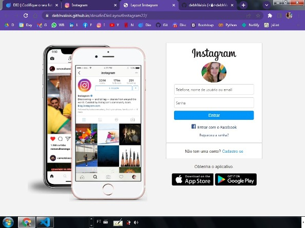

<h1 align="center">
  
</h1>

 Status <☕>Finalizado<☕/> HTML | CSS 

# Desafio DIO | Bootcamp HTML Web Developer | Layout Instagram | Março 2022

### Descrição

- [x] Reproduzir a tela de login do Instagram com HTML & CSS FlexBox (estática).

## 📁 Acessibilidade:

- Para ler os códigos fonte, basta acessá-los diretamente nesse repositório.     

- Para acessar a page, clique na imagem abaixo com o *scroll* ou com o botão direito do mouse para abrir em nova aba:

## :hammer_and_wrench: Tecnologias Utilizadas:

- Para a estrutura da page & linkagem *HTML5*.

- Para a estilização do layout *CSS3 com FlexBox*.

- Para deployer e repositório *Git* & *GitHub*.

- Tudo foi editado e rodado no IDE *VSCode*. 

O desafio levou 1 dia para execução entre: passo-a-passo da aula, adaptação da interface, refatoração, organização deployers e readme.

## :octocat: A Autora: 

<table>
  <tr>
    <td align="center">
      <a href="#">
         
        
          <b>Debh Valois</b>
        
      </a>
    </td>
  </tr>
</table>

